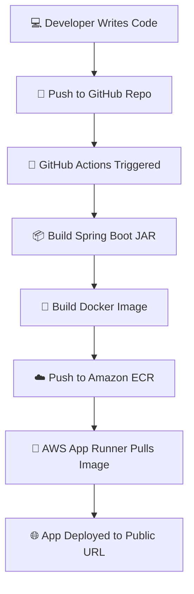

## 📘 `README.md` (Cleaned Up & Explained)


# 🚀 Spring Boot on AWS App Runner with GitHub Actions CI/CD

Welcome to a complete deployment pipeline for your **Spring Boot app** using:
- 🐳 Docker
- ☁️ Amazon ECR
- ⚙️ AWS App Runner
- 🤖 GitHub Actions

This project shows how to go from code ➡️ container ➡️ deployed app automatically using CI/CD. This `README.md` will guide you through every step including screenshots, IAM setup, Dockerization, and deployment.

---

## 🧰 Tech Stack

- ☕ Spring Boot (Java 21)
- 🐳 Docker (multi-stage)
- 🛢️ Amazon ECR
- 🚀 AWS App Runner
- 🔐 IAM for secure access
- 🤖 GitHub Actions (CI/CD)

---

You're welcome! Here's a **simple yet clear flow diagram** that shows the end-to-end process — **from code to cloud** — using your Spring Boot, Docker, GitHub Actions, ECR, and AWS App Runner stack.

---

## 🔁 Code to Cloud Flow Diagram



```
+------------------+          +---------------------+         +--------------------------+
|                  |          |                     |         |                          |
|  💻 Developer    +--------->|  🐙 GitHub Repo      +-------->+  🤖 GitHub Actions CI/CD  |
|  (Spring Boot)   |  Push    |  (Main Branch)       | Trigger |  (Workflow: Build + Push |
|                  |          |                     |         |   + Deploy)              |
+------------------+          +---------------------+         +------------+-------------+
                                                                              |
                                                                              v
                                                               +--------------+-------------+
                                                               |                            |
                                                               |  🐳 Docker Build & Push     |
                                                               |  (Build image, push to     |
                                                               |   Amazon ECR registry)     |
                                                               +--------------+-------------+
                                                                              |
                                                                              v
                                                             +-------------------------------+
                                                             |                               |
                                                             |  🚀 AWS App Runner Deploys     |
                                                             |  (Pull image from ECR, run    |
                                                             |   container with access role) |
                                                             +-------------------------------+
                                                                              |
                                                                              v
                                                           +-------------------------------------+
                                                           |                                     |
                                                           |  🌐 Live Application URL (Public)   |
                                                           |  https://<random>.awsapprunner.com |
                                                           +-------------------------------------+
```

---

### 📦 Components Explained:

| Symbol | Description                                   |
| ------ | --------------------------------------------- |
| 💻     | Developer writes Spring Boot code             |
| 🐙     | Code pushed to GitHub triggers workflow       |
| 🤖     | GitHub Actions builds app, pushes to ECR      |
| 🐳     | Docker image created and uploaded to AWS ECR  |
| 🚀     | App Runner pulls from ECR and deploys the app |
| 🌐     | App is now live on a public URL               |

---


## 📦 Dockerfile Explained

### 🔍 What is a Multi-Stage Build?

In Docker, a **multi-stage build** allows you to:
- Compile and build your application in one stage
- Copy only the final `.jar` to a clean runtime image in another stage

👉 This reduces image size and keeps the production image clean and secure.

### 🐳 Dockerfile Breakdown

```Dockerfile
# 🏗️ Stage 1: Builder
FROM eclipse-temurin:21-jdk AS builder
WORKDIR /app
COPY . .
RUN ./mvnw clean package -DskipTests
````

* Uses JDK to **build the Spring Boot JAR**
* Skips tests for faster CI builds
* Packages everything into `target/app.jar`

```Dockerfile
# 🚀 Stage 2: Runtime
FROM eclipse-temurin:21-jre
WORKDIR /app
COPY --from=builder /app/target/*.jar app.jar
EXPOSE 8080
ENTRYPOINT ["java", "-jar", "app.jar"]
```

* Uses a smaller JRE image (Java Runtime only)
* **Only the JAR** is copied from the builder stage
* Exposes port `8080` and starts your Spring Boot app

### ✅ Benefits:

* Smaller image size
* Faster startup
* No Maven or source code in the final container

---

## 📁 .dockerignore

Keeps your Docker image clean by ignoring unnecessary files:

```dockerignore
target/
.git
.gitignore
README.md
Dockerfile
```

---

## 🔐 IAM Setup (Security First)

### 🧑‍💻 IAM User for GitHub Actions

Create an IAM user (e.g., `springboot-app-runner`) with:

* `AmazonEC2ContainerRegistryFullAccess` ✅
* `AWSAppRunnerFullAccess` ✅
* Custom inline policy:

```json
{
  "Effect": "Allow",
  "Action": "iam:PassRole",
  "Resource": "arn:aws:iam::YOUR_ACCOUNT_ID:role/AppRunnerECRAccessRole"
}
```

This allows GitHub Actions to **pass a role to App Runner**.

📸 **Add screenshot here showing IAM user creation**

---

### 🎟️ IAM Role for App Runner (access-role-arn)

Create a new **IAM Role** with:

**Trust Policy (custom):**

```json
{
  "Effect": "Allow",
  "Principal": {
    "Service": "build.apprunner.amazonaws.com"
  },
  "Action": "sts:AssumeRole"
}
```

**Permissions:**

* Attach: `AmazonEC2ContainerRegistryReadOnly`

📸 **Add screenshot here showing role creation**

---

## 🏗️ GitHub Actions Workflow: Step-by-Step

### ✅ 1. Checkout Code

```yaml
- uses: actions/checkout@v3
```

➡️ Pulls your latest source code from GitHub.

---

### ☕ 2. Set Up Java

```yaml
- uses: actions/setup-java@v3
  with:
    java-version: '21'
    distribution: 'temurin'
```

➡️ Configures Java 21 environment for building your Spring Boot app.

---

### 🧪 3. Build the App

```yaml
- run: ./mvnw clean package -DskipTests
```

➡️ Uses Maven Wrapper to build the app JAR and skip tests.

---

### 🔐 4. Authenticate to AWS

```yaml
- uses: aws-actions/configure-aws-credentials@v2
```

➡️ Uses `AWS_ACCESS_KEY_ID` and `AWS_SECRET_ACCESS_KEY` to allow access to AWS services.

---

### 📦 5. Log in to Amazon ECR

```yaml
- uses: aws-actions/amazon-ecr-login@v1
```

➡️ Logs Docker into your ECR registry so it can push the image.

---

### 🐳 6. Build and Push Docker Image

```bash
docker build -t $IMAGE_URI .
docker push $IMAGE_URI
```

➡️ Builds your app into a Docker image and pushes it to ECR.

---

### 🚀 7. Deploy to App Runner

```yaml
- uses: awslabs/amazon-app-runner-deploy@main
  with:
    service: springboot-apprunner
    image: 904233094040.dkr.ecr.us-east-1.amazonaws.com/my-springboot-app:latest
    region: us-east-1
    access-role-arn: ${{ secrets.APP_RUNNER_ACCESS_ROLE_ARN }}
```

➡️ Deploys the latest image from ECR to **AWS App Runner**
➡️ Uses the **IAM role** to pull the image securely

---

## 📬 GitHub Secrets Required

In your GitHub repo → `Settings > Secrets and variables > Actions`:

| Key                          | Description                 |
| ---------------------------- | --------------------------- |
| `AWS_ACCESS_KEY_ID`          | From IAM user               |
| `AWS_SECRET_ACCESS_KEY`      | From IAM user               |
| `APP_RUNNER_ACCESS_ROLE_ARN` | IAM role used by App Runner |

---

## 📸 Screenshots (Add Yours Here)

* ✅ Spring Initializr setup
* 🔐 IAM User creation
* 🧾 IAM Role creation with trust policy
* 📦 ECR repository screen
* 🚀 App Runner deployment success

---

## 🌐 Final Result

Once deployed, App Runner will give you a public URL like:

```
https://springboot-apprunner-xyz123.us-east-1.awsapprunner.com
```

You can test it by visiting:

```
GET /
Response:
{
  "status": "success",
  "data": {
    "message": "Server is online",
    "code": 200
  }
}
```

---

## 🚧 Future Improvements

* [*] Add custom domain to App Runner
* [*] Add health checks and alerting
* [*] Switch to Terraform IaC
* [*] Add staging environment

---

## 🙌 Acknowledgements

* AWS App Runner Docs
* GitHub Actions Marketplace
* You — for deploying Java apps the cloud-native way ☁️

---

## ✨ Done!

You now have:

✅ Dockerized Spring Boot app <br>
✅ Pushed to Amazon ECR <br>
✅ Deployed to AWS App Runner <br>
✅ Automated with GitHub Actions <br>

Enjoy shipping with confidence! 🛳️💻🌐
